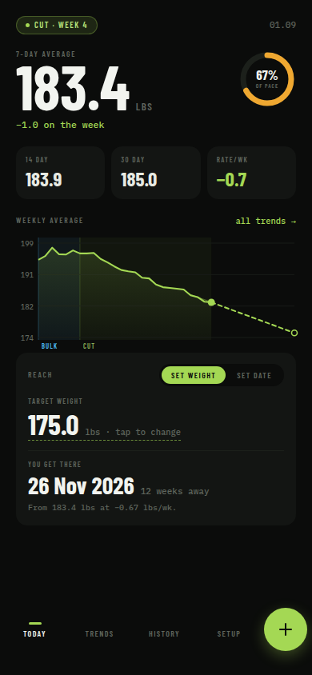
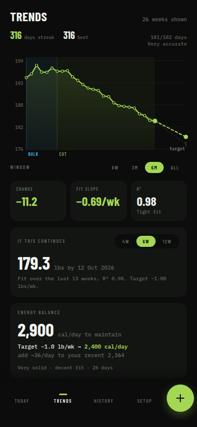
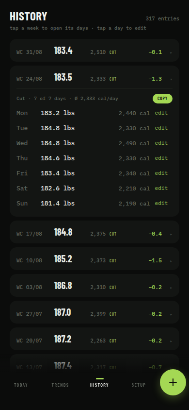
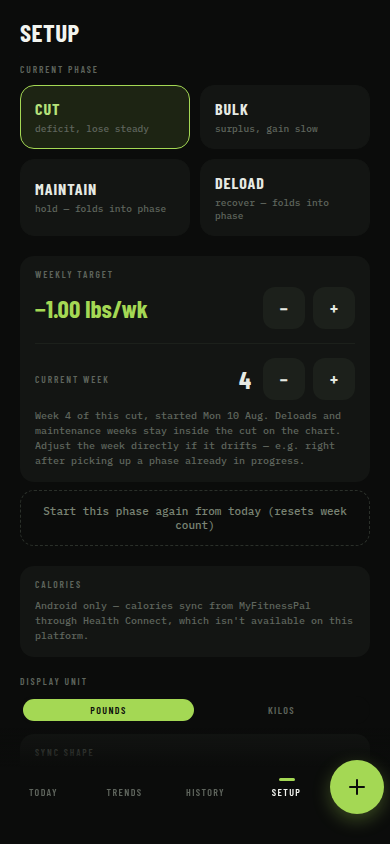

# Weight Tracker

A single-purpose weight tracking PWA for cut/bulk cycles. Log a weigh-in in one tap, judge
progress by the 7-day rolling average (not the noisy daily number), see weekly averages plotted
with a line of best fit, and ask "if this continues, when do I hit X?" in both directions — set a
target weight and get a date, or set a date and get a projected weight.

On Android it also reads your daily calories from MyFitnessPal (via Health Connect) and turns the
weight trend plus intake into an adaptive-TDEE maintenance estimate and a calorie target for your
weekly goal.

Ships as a web PWA and as a native Android app via Capacitor.

<p align="center">
  
  
  
  
</p>

## Stack

- **React + Vite + TypeScript**, no router — four screens (`Today`, `Trends`, `History`, `Setup`)
  switch on a single `screen` field in a React Context + `useReducer` store.
- **Supabase** (Postgres + email magic-link auth) for storage, with a `localStorage` cache and an
  offline write queue in front of it — logging a weigh-in works with no network and syncs when
  back online.
- **Capacitor** wraps the same web build as a native Android app.
- **Health Connect** (Android only) through a small custom Kotlin plugin
  (`android/app/src/main/java/com/blurryq/weighttracker/HealthConnectPlugin.kt`) reads
  MyFitnessPal's daily calorie totals; the energy-balance math is in `src/lib/energy.ts`.
- Charts are hand-rolled inline SVG (`src/lib/chartGeometry.ts` + `src/components/chart/`) — no
  charting library.

## Project layout

```
src/
  lib/        pure, unit-tested math: rolling averages, phase spans, least-squares fit,
              the bidirectional Reach solver, chart geometry, adaptive-TDEE energy math
  store/      state shape + reducer + the AppContext that wires in persistence/sync
  data/       Supabase client, offline queue, sync, auth gate, Health Connect bridge
  components/ shared UI (nav, chart, entry sheet, ui primitives)
  screens/    Today, Trends, History, Setup
tests/        vitest, run against a fixture of 317 real weigh-ins (tests/fixtures/weight-data.ts)
supabase/
  migrations/ 0001 schema (entries, phase_log, settings + RLS), 0004 daily_nutrition
android/      Capacitor-generated native project
```

## Local development

```bash
npm install
cp .env.example .env.local   # fill in your Supabase project URL + anon key
npm run dev
```

Without Supabase credentials the app still runs — every `src/data/api.ts` call checks
`supabaseConfigured` and no-ops, so you get a fully local, offline-only session. Fresh installs
boot with no entries (log a weigh-in to get started).

### Database setup

Run the migrations in `supabase/migrations/` in order via the Supabase SQL Editor (or the
Supabase CLI once you're linked to a project). `0001_init.sql` creates the core schema;
`0004_nutrition.sql` adds the `daily_nutrition` table for the calories feature.

### Other scripts

```bash
npm test     # vitest — pure-function tests (math, chart geometry, energy, reducer) vs. the real 317-entry fixture
npm run lint # oxlint
npm run build
```

## Android

```bash
npm run build
npx cap sync android
cd android && ./gradlew assembleDebug
adb install -r app/build/outputs/apk/debug/app-debug.apk
```

Needs a JDK (not just a JRE) and the Android SDK on `$ANDROID_HOME`. The debug APK is unsigned —
fine for sideloading to your own device, but a release build needs a signing key before wider
distribution.

The calories feature needs the `READ_NUTRITION` Health Connect permission, requested from the
Setup screen's "Calories" section. On web builds that section just shows an "Android only" note.

Magic-link sign-in on native builds redirects through a custom `weighttracker://login-callback`
URL scheme (see `src/data/AuthGate.tsx` and the intent-filter in
`android/app/src/main/AndroidManifest.xml`) so the email link opens the app instead of a browser.
That URL also needs to be added to the Supabase project's Authentication → URL Configuration →
Redirect URLs allow-list.
